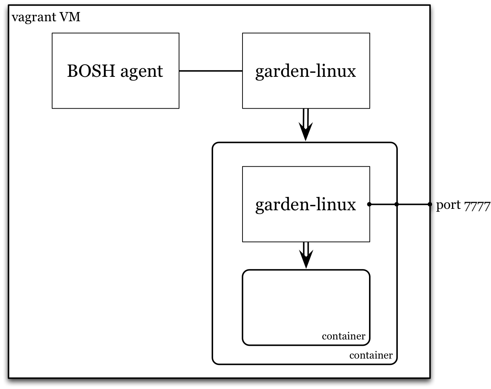

# BOSH Lite

BOSH lite is used to deploy Garden Linux inside a container, which is useful for testing Garden Linux's nested container support.


To get started with [BOSH lite](https://github.com/cloudfoundry/bosh-lite), follow the instructions to [Prepare the Environment](https://github.com/cloudfoundry/bosh-lite#install-and-boot-a-virtual-machine) and [Install and Boot a Virtual Machine](https://github.com/cloudfoundry/bosh-lite#install-and-boot-a-virtual-machine), then:

```sh
cd garden-linux-release/

# Obtain submodules
git submodule update --init --recursive

# create and upload a BOSH release
# (if there are changes in the git repository, specify --force on create)
bosh -n create release
bosh -n upload release
```

Then follow the instructions for downloading a stemcell in [Manually Deploying Cloud Foundry](https://github.com/cloudfoundry/bosh-lite/blob/master/docs/deploy-cf.md#manual-deploy), choosing a stemcell with `warden-boshlite-ubuntu-trusty` in the name:
```
bosh public stemcells
bosh download public stemcell <stemcell_name>
```

Upload the downloaded stemcell to the BOSH lite instance:
```
bosh upload stemcell <stemcell_file_name>
```

Then deploy Garden Linux to BOSH lite:
```
bosh deployment manifests/bosh-lite.yml
bosh deploy
```

Check the state of the deployment:
```
bosh vms
bosh ssh <Garden job/index>
```
Make a note of the IP address of the Garden job.

Then, assuming you ran `bin/add-route` as part of setting up BOSH Lite, proceed to kick the tyres.

## Kick the tyres

Use the [REST API](https://github.com/cloudfoundry-incubator/garden#rest-api) against endpoint `http://<IP address of Garden job>:7777` outside the VM or `http://127.0.0.1:7777` inside the VM. Create a container, then:
```
# spawn a process
#
# curl will choke here as the protocol is hijacked, but...it probably worked.
curl -H "Content-Type: application/json" \
  -XPOST http://<REST endpoint>/containers/${handle}/processes \
  -d '{"path":"sleep","args":["10"]}'
```

From inside the VM, see `sleep 10` running:
```
bosh ssh
ps auxf

# hop in the container:
cd /var/vcap/data/garden/depot/${handle}
./bin/wsh
```