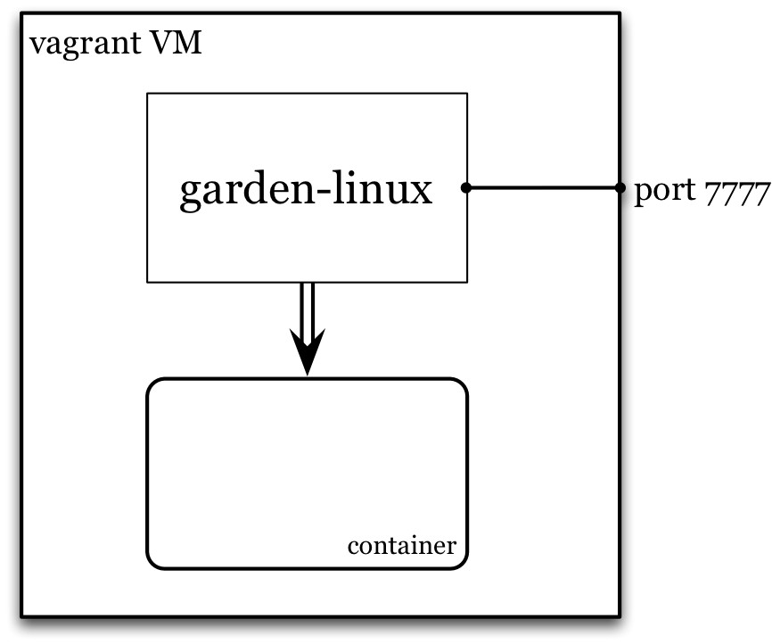

# Vagrant BOSH

Vagrant BOSH is used to deploy Garden Linux to its own virtual machine, i.e. not inside a container. Garden Linux may then be used to create one or more containers.


To get started with [Vagrant BOSH](https://github.com/cppforlife/vagrant-bosh):

```sh
cd garden-linux-release/

# Obtain submodules
git submodule update --init --recursive

# install the Vagrant BOSH provisioner
vagrant plugin install vagrant-bosh

# install BOSH
gem install bosh_cli --no-ri --no-rdoc

# provision
vagrant up
```


## Kick the tyres

Use the [REST API](https://github.com/cloudfoundry-incubator/garden#rest-api) against endpoint `http://127.0.0.1:7777` to create a container, then:
```sh
cd garden-linux-release/

# spawn a process
#
# curl will choke here as the protocol is hijacked, but...it probably worked.
curl -H "Content-Type: application/json" \
  -XPOST http://127.0.0.1:7777/containers/${handle}/processes \
  -d '{"path":"sleep","args":["10"]}'

# from inside the vagrant vm...
vagrant ssh

# ... see 'sleep 10' running:
ps auxf

# hop in the container:
cd /var/vcap/data/garden/depot/${handle}
sudo ./bin/wsh
```

## Debugging

```sh
cd garden-linux-release/

vagrant ssh

# escalate to root
sudo su -

# check logs:
tail -f /var/vcap/sys/log/**/*.log

# check monit:
monit status

# restart garden
monit restart garden

# poke around the deployed jobs
less /var/vcap/jobs/...
```


## Development

See the [usage of directories in a BOSH release](https://www.pivotaltracker.com/story/show/78508966).

This repository also includes files, in the `ci` and `scripts` directories, to integrate with [Concourse](https://github.com/concourse/concourse).

## Update the release

Once the VM is up, modify it by issuing:
```
vagrant provision
```

## Create another blob
See the bosh documentation for [adding blobs](http://docs.cloudfoundry.org/bosh/create-release.html#blobs) including setting up `config/private.yml` with appropriate S3 keys, and then issue:
```
bosh upload blobs
```

## Destroy the release
```
vagrant destroy
```
